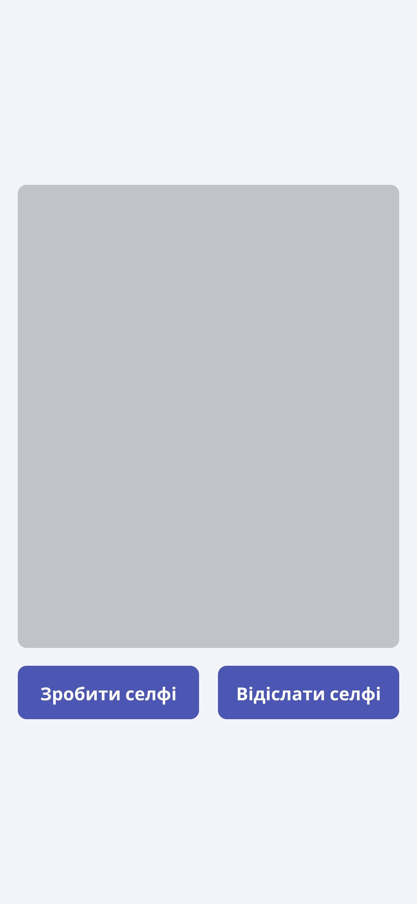

# Додаток для відсилки селфі

#### Завдання. Треба розробити мобільний додаток з наступним функціоналом.

1. Мобільний додаток складається з одного `Activity`, в якому розташований елемент `ImageView` та дві кнопки.

<table>
<tr>
<td>

  </td>
  <td>

  </td>
</tr>
</table>

2. При натисканні на кнопку "Зробити селфі" повинно відкритися `Activity` додатку камери, в якому користувачу потрібно зробити селфі або зробити інший знімок.

3. Після підтвердження операції створення нового знімку, повинен знову відкритися користувацький додаток, причому, зроблений знімок повинен відобразитися в `ImegeView`.

4. Після того, як користувач отримав зображення, він може натиснути на кнопку відіслати селфі.

5. При настисканні на кнопку, повинно відкритися `Activity` створення нового листа електронної пошти додатку роботи з електронною поштою.

6. При відкритті вікна, у полі адреса відправника повинна бути додана адреса hodovychenko@op.edu.ua

7. При відкритті вікна, у полі теми листа бути додана тема "ANDROID [прізвище та ім'я]".

8. В тексті письма в додатках повинен бути доданий файл із селфі.

9. Після цього треба відіслати листа.

10. Також, в текст письма додати посилання на репозиторій із проєктом мобільного додатку.
